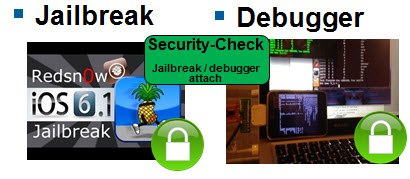

# iMAS security-check

## Background

The iMAS secuirty-check security control offers a continuous jailbreak detect and debug attach checking.  With this information, one can programatically decide to shutdown the app or other loss prevention techniques.  The security control makes system calls at the application level, in particular ptrace and getpid  

## Vulnerabilities Addressed
1. Debugger tool use
   - CWE-288: Authentication Bypass Using an Alternate Path or Channel



## Installation

- Add security-check repository as a submodule to your project `git submodule add git@github.com:project-imas/security-check.git vendor/security-check`
- Drag SecurityCheck.xcodeproj into the your project as a subproject
- Add SecurityCheck Framework to target’s build phase - target dependancies (use +)
- Add libSecurityCheck.a to targets's build phase - link binary with libraries
- include #import <SecurityCheck/SecurityCheck.h> in your code at the app delegte level to start

## Usage


```
    //-----------------------------------
    // call back to weHaveAProblem
    //-----------------------------------
    cbBlock chkCallback  = ^{
        

        __weak id weakSelf = self;
        
        if (weakSelf) [weakSelf weHaveAProblem];
    };

    //-----------------------------------
    // jailbreak detection
    //-----------------------------------
    checkFork(chkCallback);
    checkFiles(chkCallback);
    checkLinks(chkCallback);
    
    ...
    
    //** Note: Rename this function in your code
- (void) weHaveAProblem {
    
    NSLog(@"weHaveAProblem in AppDelegate");
    
        //** cause segfault
    //int *foo = (int*)-1; // make a bad pointer
    //printf("%d\n", *foo);       // causes segfault
    
    //** OR launch blank, black colored window that hangs the user
    SViewController *sc = [[SViewController alloc] init];
    _window.rootViewController = sc;
    [_window makeKeyAndVisible];

#if 1
    //** OR re-launch the splash screen, must be preceded by SViewController as that controller overwrites the rootcontroller
    //** which changes the app flow
    UIImageView *myImageView =[[UIImageView alloc]
                               initWithFrame:CGRectMake(0.0,0.0,self.window.frame.size.width,self.window.frame.size.height)];
    
    myImageView.image=[UIImage imageNamed:@"Default.png"];
    myImageView.tag=22;
    [self.window addSubview:myImageView ];
    [myImageView release];
    [self.window bringSubviewToFront:myImageView];
#endif
    
    //** OR make this thread stop and spin
    //volatile int dummy_side_effect;
    //
    //while (1) {  dummy_side_effect = 0; }
    //NSLog(@"Never prints.");


    //** recommend not EXITing as foresics can easily find exit(0) and replace with NOP
    //exit(0);
}

 ```   

## Sample App

The sample application demonstrates the use of the security-check security control.


## License

Copyright 2013 The MITRE Corporation, All Rights Reserved.

Licensed under the Apache License, Version 2.0 (the "License");
you may not use this work except in compliance with the License.
You may obtain a copy of the License at

    http://www.apache.org/licenses/LICENSE-2.0

Unless required by applicable law or agreed to in writing, software
distributed under the License is distributed on an "AS IS" BASIS,
WITHOUT WARRANTIES OR CONDITIONS OF ANY KIND, either express or implied.
See the License for the specific language governing permissions and
limitations under the License.

[](http://githalytics.com/project-imas/security-check)


